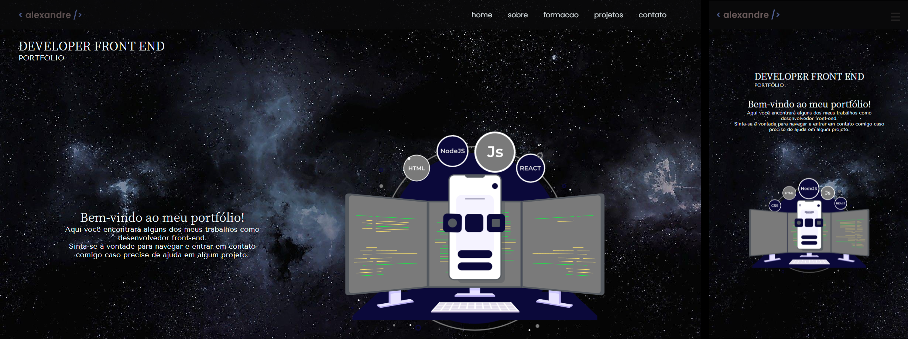

  <h1>Portifolio</h1>
  

[acesse o portfolio ](https://portifolio-allesoares.vercel.app/)

## Sobre
    O objetivo desse portfólio é exibir algumas informações sobre mim, minha formação acadêmica, cursos finalizados, habilidades com desenvolvimento,projetos e rede de contato.

    Sobre mim, irá conter informações de conhecimento de tecnologias que estudo e meus objetivos pessoais.

    Nas formações acadêmica se encontra minhas habilidades de Desenvolvimento,no qual venho estudando e práticando e também cursos que já estão finalizados.

    Nos meus projetos você irá encontrar detalhes de como foram criados, tecnologias utilizadas e link do repositório. Nos repositório tambem terá links com a aplicação funcionando.

    Em contatos terá minha rede de contato LinkedIn, meu GitHub e um formulário que está conectado com meu e-mail, assim você poderar enviar mensagem caso tenha alguma dúvida ou pergunta.

    Espero que goste!

# Tecnologia utilizadas:

    * JavaScript
    * TypeScript
    * React
    * Next
    * NodeJs
    * Styled-Components
    * Bibliotecas de Componentes React
